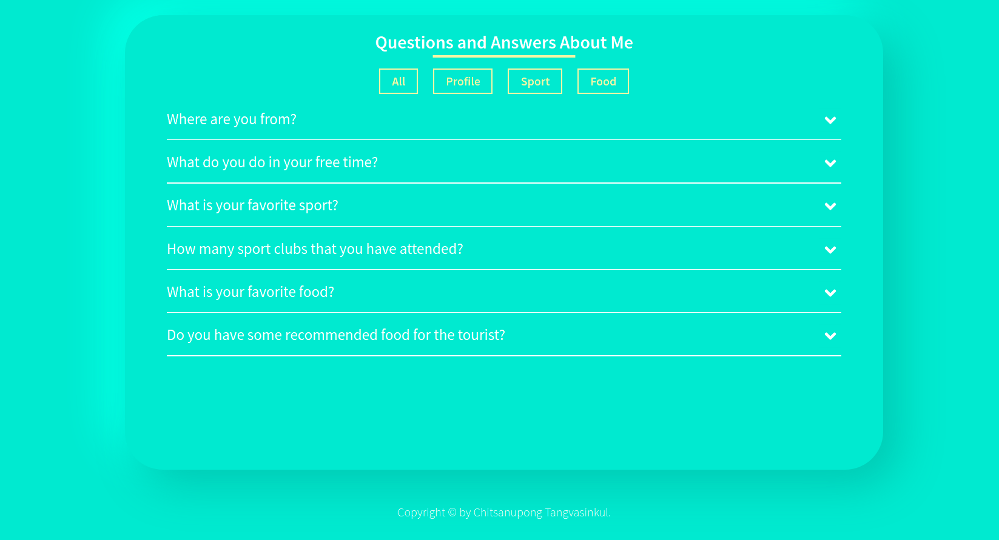

# Questions-and-Answers-WebApplication

Questions and Answers web application is related to Q & A about myself which make you know me little better. I used neumorphism design - similar with skeuomorphism- to design this website and I really like it. This also my first project used Firebase to store data and treat as a realtime database as well as Firebase web hosting. Firebase has many of features to manage back-end site such as database and web hosting. Firebase is easy to use with just a few learning about it. So, I really recommend you to try this amazing tools from Google. This web application displays questions and answers about me with classification of question types which are All, Profile, Sport and Food. Each type of question has 2 questions and answers. So, I hope you enjoy with my website!

### Technologies

### React
- useState
- useEffect (fetch API from Firebase realtime database) 
- useRef (select HTML DOM to dynamically adjust height of answers)
- conditional rendering (loading page, handle error)

### Dependency
- node-sass - use Sass in React
- firebase - use for initialize firebase to allow using realtime database

### Description
- I use neumorphism to design website.
- All of the animation use conditional rendering and useRef.
- There are three types of question and each type has 2 answers.
- When you click at the arrow button, the answer section will appear as the white edge slide down to the bottom.
- All of the questions and answers fetch from Firebase realtime database.
- I chose Firebase web hosting to host this website - very convenient and effective way to do.
